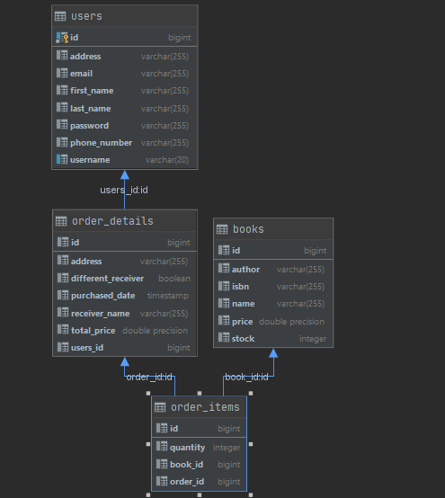

# ReadingIsGood

ReadingIsGood is an online books retail firm which operates only on the Internet.
It is a demo project for case interview.

Project APIs provide; create books, order these books and view the details.

There are Order,OrderItem, Book,User,Statistic entity You can see the relation between these.



## Getting Started

* To get response from endpoints , you need to register with /register API and then authenticate with /authenticate API by using registered username and password.
* Now, you have Bearer token from /authenticate you can request to other APIs with this token.(Bearer JWT token)

### Dependencies

* JDK 11
* Maven Build
* PostgreSQL
* Docker Deamon


### Executing program

* You can use docker-compose to execute the program
* Here the execution step: 
* Go to the project directory and run these command in order:
```
mvn clean install
```

```
docker-compose up --build
```
You can use swagger for testing purposes:

[localhost:8089/swagger-ui.html](http://localhost:8089/swagger-ui.html)


## Contact
* Kubra Ozer /   kubra123ozer@gmail.com
